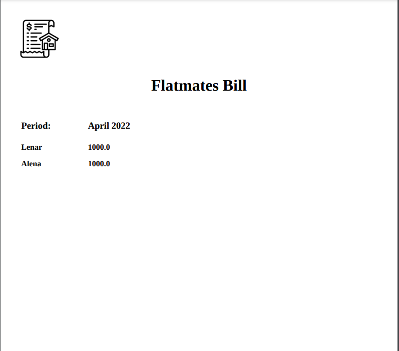

<p align="center">
    
</p>

<p align="center">
<h1 align="center"> Flatmates Bill 
    <a href="https://img.shields.io/twitter/url/http/shields.io.svg?style=social)](https://twitter.com/intent/tweet?&url=https://github.com/lenargasimov/flatmates-bill&via=lenargasimov&hashtags=python,developers">
      
    </a>
</h1>
</p>

<p align="center">
    
    
    
</p>



- Python 
- Fpdf
- Webbrowser

---

# Installation on Linux and Unix like OS

```
git clone https://github.com/lenargasimov/flatmates-bill.git
cd flatmates-bill
python3 main.py
```

# Installation on Windows

```
git clone https://github.com/lenargasimov/flatmates-bill.git
cd flatmates-bill
python main.py
```